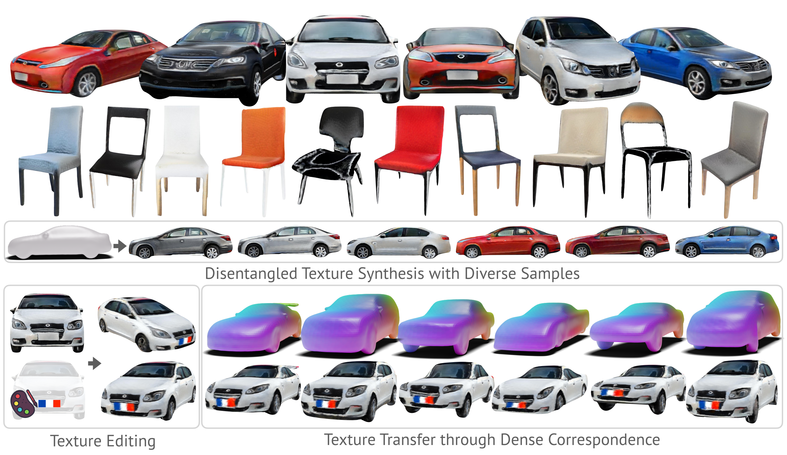

# TUVF: Learning Generalizable Texture UV Radiance Fields
An-Chieh Cheng, Xueting Li, Sifei Liu†, Xiaolong Wang†  
Check out the project website [here](https://www.anjiecheng.me/TUVF/).  

We propose Texture UV Radiance Fields (TUVF), a category-level texture representation disentangled from 3D shapes. Our methods trains from only a collection of real-world images and a set of untextured shapes. Given a 3D shape, TUVF can synthesis realistic, high-fidelity, and diverse 3D consistent textures.

## Coming Soon!

